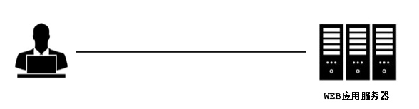
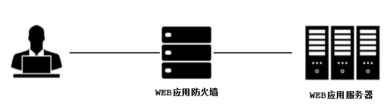
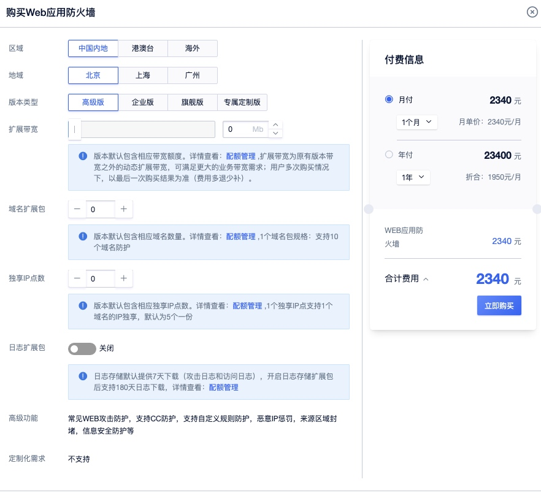
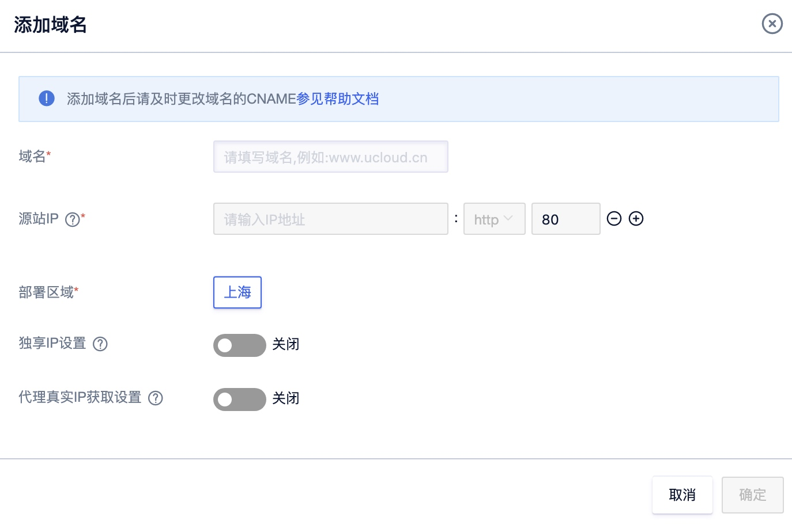
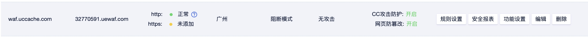
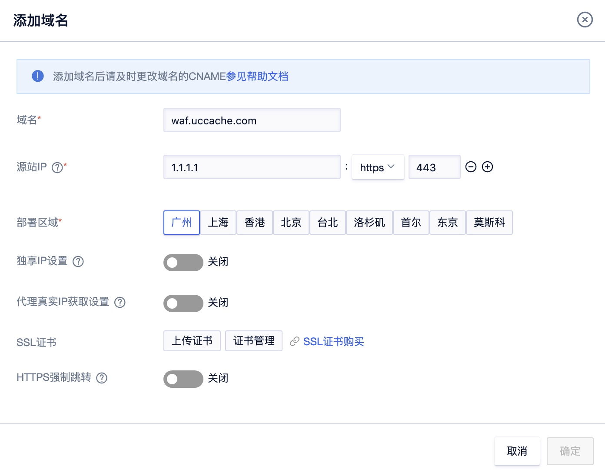
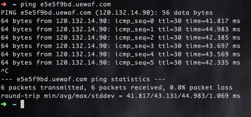
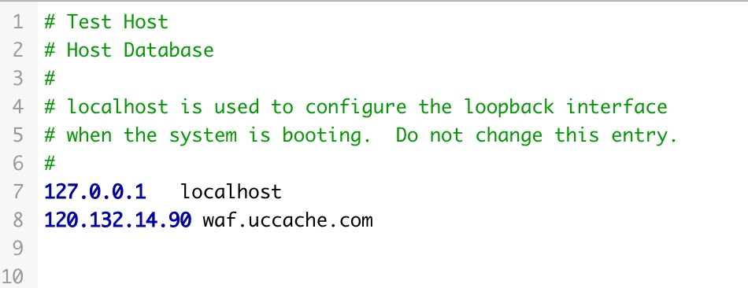
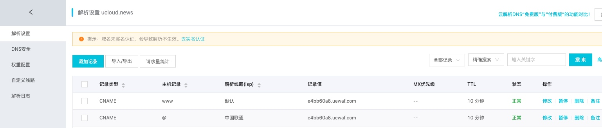
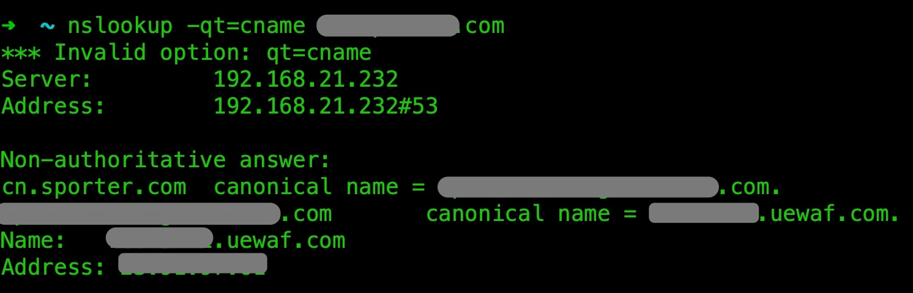

## 接入UWAF
UWAF是部署在Web服务器前，通过转发代理的方式为业务提供保护的一款产品。对流量进行内容检测，抵御包括SQL注入，XSS攻击，漏洞攻击，恶意扫描等类型的攻击行为。为网站的正常工作保驾护航。



接入UWAF前后对比：




### 1.进入UWAF控制台

登陆UCloud控制台-U盾-企业应用防火墙UWAF（如未开通请先开通该服务）


#### 参数说明：

  - 区域：选择中国内地，港澳台，海外任意区域的UWAF
  - 地域：UWAF为受保护域名的配置生成区域
  - 版本类型：版本型号，具体的性能对比，请在选品选型查看
  - 扩展带宽：额外的带宽补充
  - 扩展域名数：额外的域名补充
  - 独享IP点数：额外的独享IP点数
  - 日志扩展服务：满足等保需求，存储日志180天
  - 高级功能：具体的功能对比，请在选品选型查看

### 2.添加域名
1. 点击【域名管理】-【添加域名】
2. 在弹窗中填写站点域名和对应的用户域名源站地址，域名可以是泛域名或者完整的子域名。点击【确定】后，在界面上获取生成的CNAME信息。
    
3. 域名信息展示
    
    
    !> 注意：域名必须是已经备案的，未备案的域名将无法添加。`

4. HTTPS站点，需要上传站点的HTTPS证书。
    

#### 参数说明

  - 域名：用户的网站域名
  - 源站IP：对应的网站源站地址 ，协议类型 ，端口设置
  - 部署区域：UWAF为受保护域名的配置生成区域
  - 使用独享IP：是否为该域名独立分配一个IP
  - SSL证书：需要上传
  - HTTPS强制跳转：是否开启HTTP转HTTPS的强制跳转(此功能开启后，不可设置80端口服务)

### 3. 本地测试

1. 使用ping命令获取CANME对应的IP地址。
2. 修改本地电脑的hosts记录，将站点域名指向ping对应CNAME得到的IP地址，这样可以在本地测试流量是否经过UWAF。

```
WINDOWS（xp/2003/vista/2008/7/8）用户HOSTS文件是在“c:\windows\system32\drivers\etc”
MAC用户HOSTS文件在”/private/etc/“
打开hosts文件，编辑里面域名后面的IP地址，请替换为cname对应的IP地址。
```


### 4.修改DNS记录

如下图所示，拿到对应域名的CNAME值后，需要到DNS服务商处添加CNAME记录，将站点的域名正确解析至UWAF提供的CNAME。


### 5.测试配置是否正确

验证CNAME的解析是否完成，步骤如下：

1. 在Windows操作系统中，选择“开始 \> 运行”，在弹出框中输入“cmd”，按“Enter”。
2. 执行以下命令  ``nslookup （空格） -qt=cname（空格） 域名``
3. 查询CNAME，如果回显的域名是配置的CNAME，则表示配置成功。


### 6.模式选择
当用户配置完DNS解析后，需要返回UWAF控制台，调整需要防护域名的工作模式为阻断模式，这样就正式开启了UWAF的使用。


