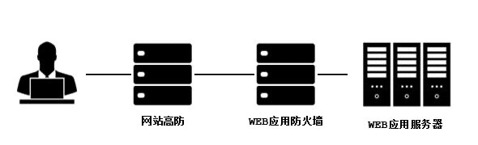
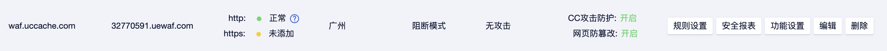
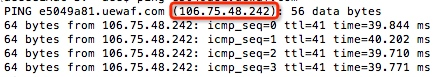
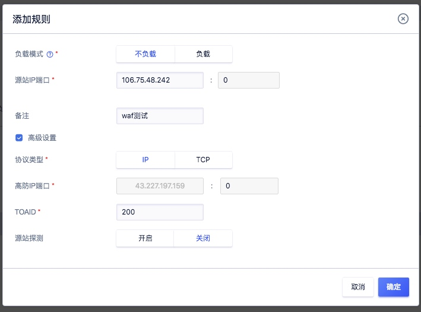
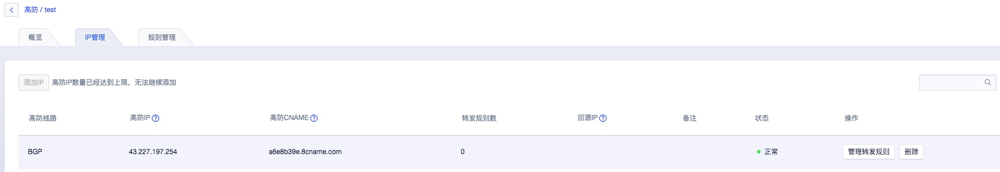
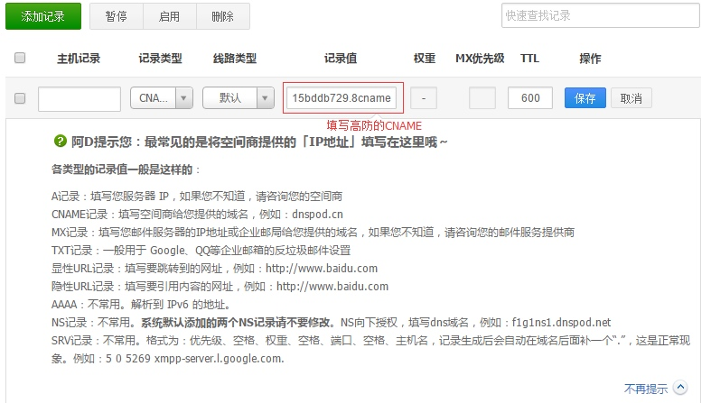

## 高防服务结合UWAF

UCloud高防服务和企业应用防火墙（UWAF）是完全兼容的。

### 部署架构

### 1.进入UWAF界面

登陆UCloud控制台-全部产品-Web应用防火墙UWAF（如未开通请先开通该服务）

### 2.添加域名

在UWAF中点击【添加域名】。在弹窗中填写站点域名，域名可以是泛域名或者完整的子域名。点击【确定】后，在界面上获取生成的CNAME信息。

!>注意：域名必须是已经备案的，未备案的域名将无法添加。`

如果防护的是https站点，需要同时上传站点的HTTPS证书。

### 3.PING CNAME获取IP

PING CNAME域名得到分配的UWAF的IP

### 4.修改高防源站IP

1. 配置高防，源站IP填写刚才得到的UWAF的IP。
    

2. 点击确定后，会生成高防的CNAME地址.
    

3. 后续配置DNS，将需要防护的域名解析到高防CNAME，即可完成配置。
    