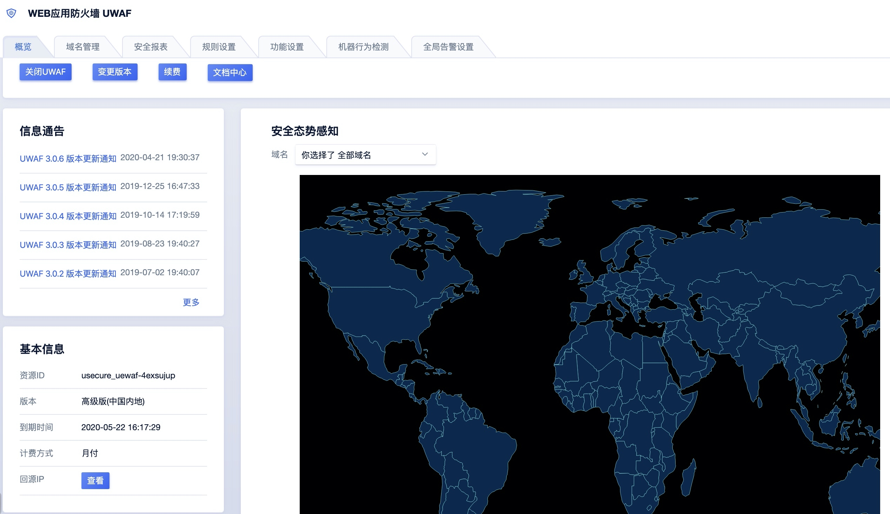
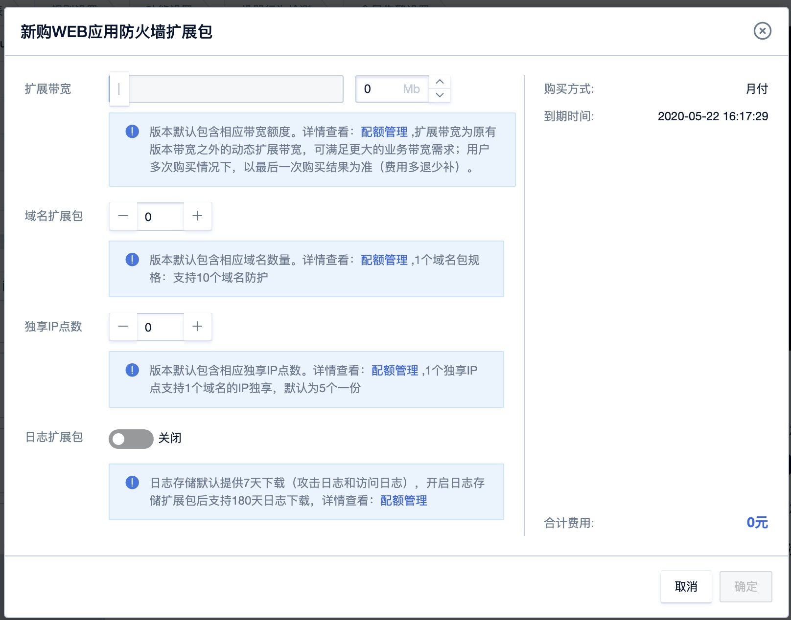

## 概览

### 概览功能说明：
概览可以查看用户UWAF产品的一些相关的动态信息，其中包括信息通告、产品基本信息、攻击态势感知图、以及实时拦截情况。并且还可以根据剩余的配额提示，购买相对应的资源扩展。

#### 参数说明
###### 功能部分

  - 关闭UWAF：关闭产品
  - 变更版本：更换现有UWAF产品版本
  - 续费：产品正续费功能
  - 文档中心：跳转至官网文档中心

###### 信息通告

  - 用于产品更新及预警信息的功能发布 

###### 基本信息

  - 资源ID
  - UWAF版本
  - 到期时间
  - 计费方式
  - 回源IP查看

###### 剩余配额

  - 域名数使用情况
  - 独享IP使用情况
  - 带宽使用情况

#### 配额管理

  - 扩展带宽：购买额外的流量带宽
  - 域名扩展包：购买额外的域名数
  - 独享IP点数：购买额外的独享IP点数
  - 日志扩展包：对流量日志进行180天的服务存储（旗舰版及以上不用另行购买此服务）

#### 攻击概览

  - 实时的攻击流量图
  - 实时的攻击展示
  - 总攻击次数等

