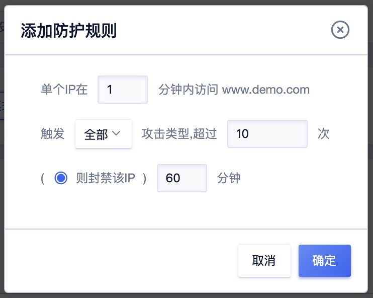

## 恶意 IP 封禁

该功能⽤户可以指定当前域名在多久时间内遭受到多少次攻击后，让系统自动对该请求来源IP进行封堵处理，如果前方有第三方代理，在未获取准确来源IP的情况下，可能造成误封操作。

#### 添加规则参数说明：

  - 时间：检测周期
  - 触发：指定的攻击类型，默认为全部
  - 次数阈值：限制的攻击次数
  - 动作：封禁处理
  - 时长：封禁时间

攻击定义:触发WAF防护规则的攻击，触发CC规则的攻击，触发⽤户⾃定义规则的请求(不包括⽤户定义的放行规则)

> 备注:封堵的IP⽤户可以在 功能设置 —> ⿊名单 当中查看。

