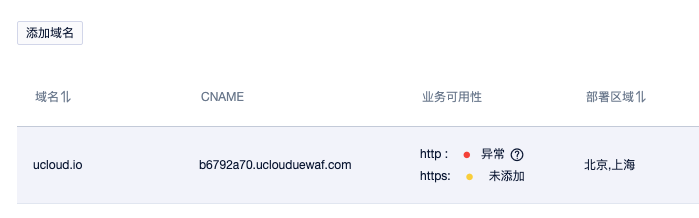
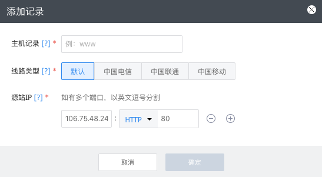
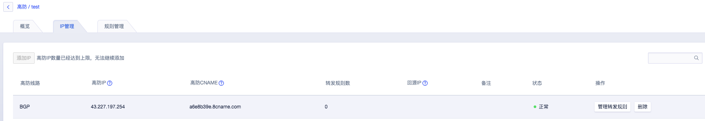
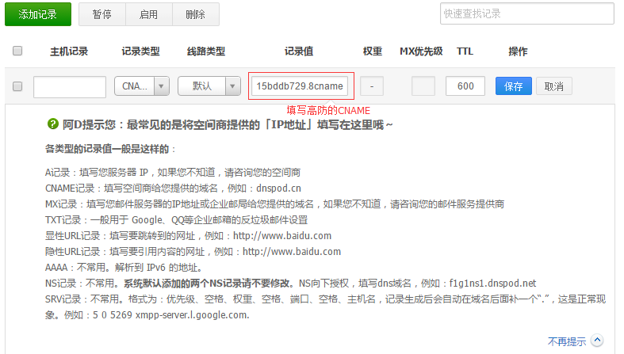

{{indexmenu_n>4}}

# 高防服务结合UWAF

UCloud高防服务和企业应用防火墙（UWAF）是完全兼容的。

部署架构

### 1.进入UWAF界面

登陆UCloud控制台-U盾-企业应用防火墙UWAF（如未开通请先开通该服务）

### 2.添加域名

在UWAF中点击【添加域名】。在弹窗中填写站点域名，域名可以是泛域名或者完整的子域名。点击【确定】后，在界面上获取生成的cname信息。

`注意：域名必须是已经备案的，未备案的域名将无法添加。`

如果防护的是https站点，需要同时上传站点的HTTPS证书。

### 3.ping CNAME获取IP

ping cname域名得到分配的UWAF的IP

### 4.修改高防源站IP

配置高防，源站IP填写刚才得到的UWAF的IP。

点击确认生成一条高防的cname记录。

配置DNS将需要防护的域名解析到高防cname，即可完成配置。

