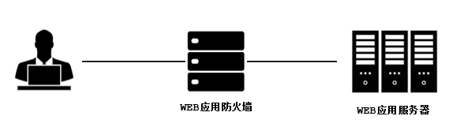
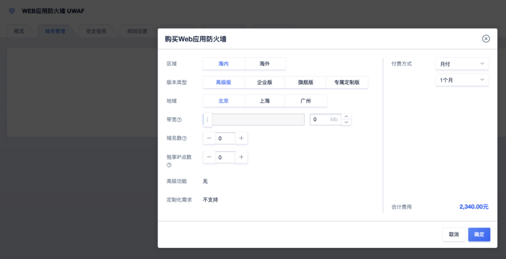
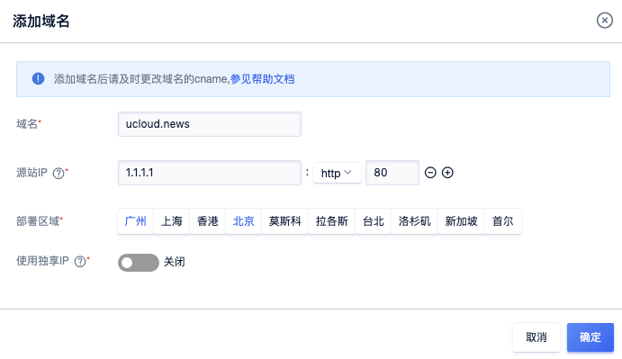
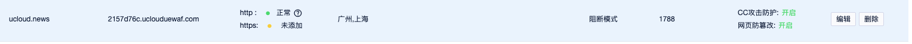
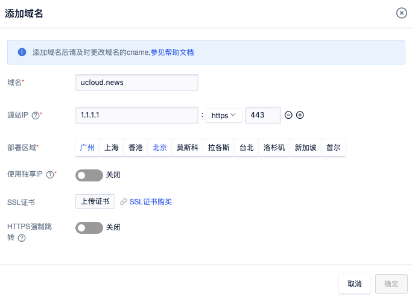
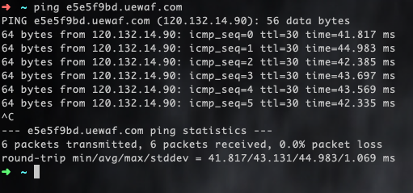
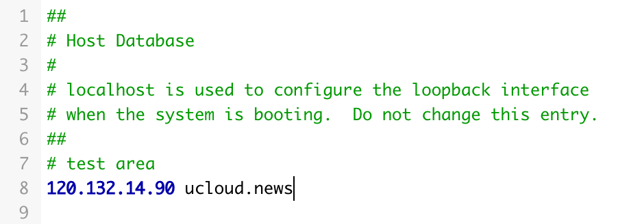
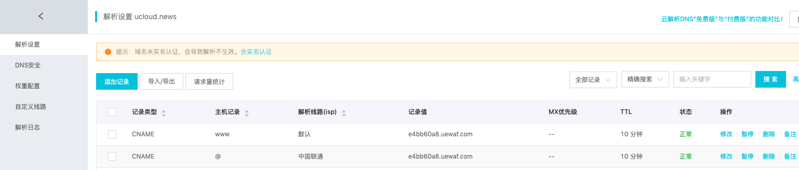
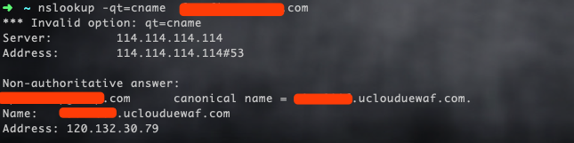

{{indexmenu_n>2}}

# 接入UWAF

UWAF用于为网站提供防护，抵御包括SQL注入，XSS攻击，漏洞攻击，恶意扫描等类型的攻击行为。


接入UWAF前后对比：




WAF是部署在web服务器前，通过转发代理的方式提供保护的一款产品。

### 1.进入UWAF控制台


登陆UCloud控制台-U盾-企业应用防火墙UWAF（如未开通请先开通该服务）



参数说明：

  - 区域：选择海内或者海外版本的UWAF
  - 版本类型：版本型号，具体的性能对比，请在选品选型查看
  - 地域：UWAF为受保护域名的配置生成区域
  - 带宽：额外的带宽补充
  - 域名数：额外的域名补充
  - 独享IP点数：额外的独享IP点数
  - 高级功能：具体的功能对比，请在选品选型查看

### 2.添加域名

点击【域名管理】-【添加域名】
在弹窗中填写站点域名和对应的用户域名源站地址，域名可以是泛域名或者完整的子域名。点击【确定】后，在界面上获取生成的cname信息。




`注意：域名必须是已经备案的，未备案的域名将无法添加。`

如果防护的是https站点，需要同时上传站点的HTTPS证书。



参数说明

  - 域名：用户的网站域名
  - 源站IP：对应的网站源站地址 ，协议类型 ，端口设置
  - 部署区域：UWAF为受保护域名的配置生成区域
  - 使用独享IP：是否为该域名独立分配一个IP
  - SSL证书：需要上传
  - HTTPS强制跳转：是否开启HTTP转HTTPS的强制跳转(此功能开启后，不可设置80端口)

### 3. 本地测试



使用ping命令获取cname对应的IP地址。

修改本地电脑的hosts记录，将站点域名指向ping对应cname得到的IP地址，这样可以在本地测试流量是否经过UEWAF。

``` 

windows xp/2003/vista/2008/7/8用户HOSTS文件是在“c:\windows\system32\drivers\etc”

MAC用户HOSTS文件在/private/etc/

打开hosts文件，编辑里面域名后面的IP地址，请替换为cname对应的IP地址。
```



### 4.修改DNS记录

如下图所示，拿到各记录的CNAME值后，需要到DNS服务商处添加CNAME记录，将站点的域名解析指向UEWAF提供的CNAME。



### 5.测试配置是否正确

验证cname的解析是否完成，步骤如下：

1、在Windows操作系统中，选择“开始 \> 运行”，在弹出框中输入“cmd”，按“Enter”。

2、执行以下命令

`nslookup （空格） -qt=cname（空格） 域名`

3、查询CNAME。如果回显的域名是配置的CNAME，则表示配置成功。


