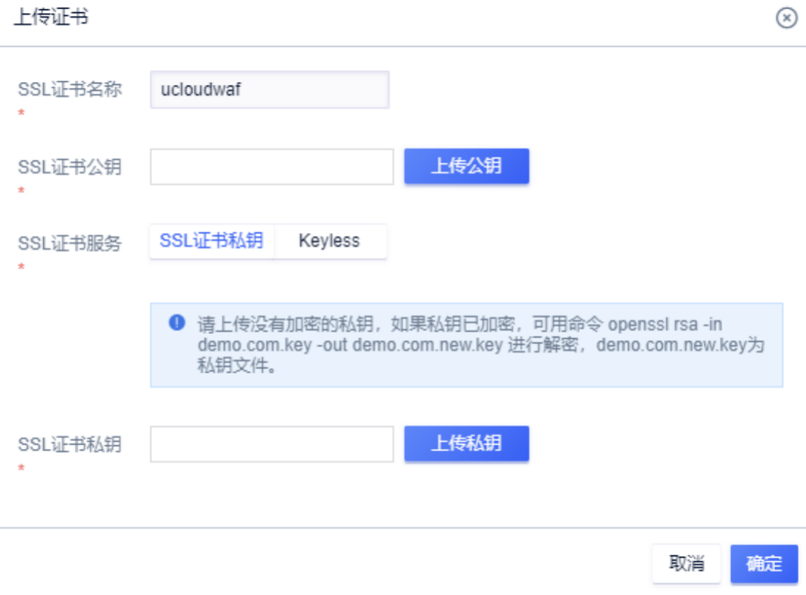

{{indexmenu_n>1}}

### UWAF的证书配置

WAF支持PEM格式的证书（可通过UCloud USSL证书购买，下载PEM格式证书文件），通常PEM格式证书包含两个文件，文件后缀为pem的是公钥文件，点击“上传公钥”按钮选择上传，文件后缀为key的是私钥文件，点击“上传私钥”按钮选择上传。
文件上传后，WAF会检查证书的正确性，如果文件错误，会给出错误码，请按如下步骤进行排查：

1、公钥文件和私钥文件是否正确；

2、上传的文件是否重复；

3、可以通过第三方工具验证证书是否正确（推荐使用https://myssl.com/match_key.html）

