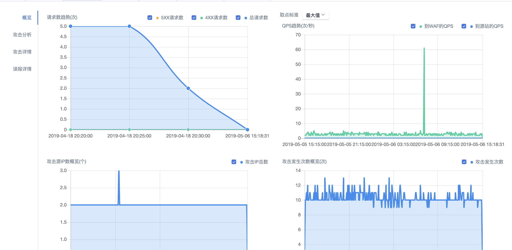
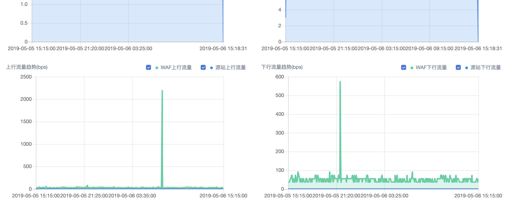
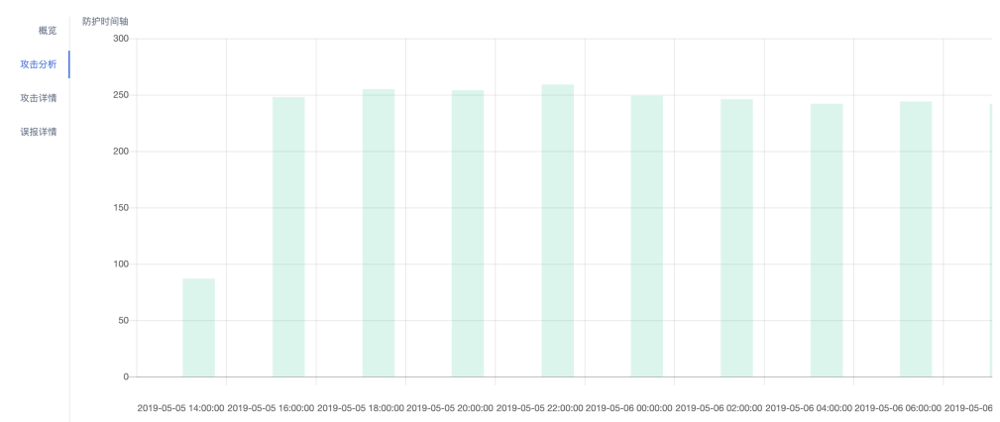
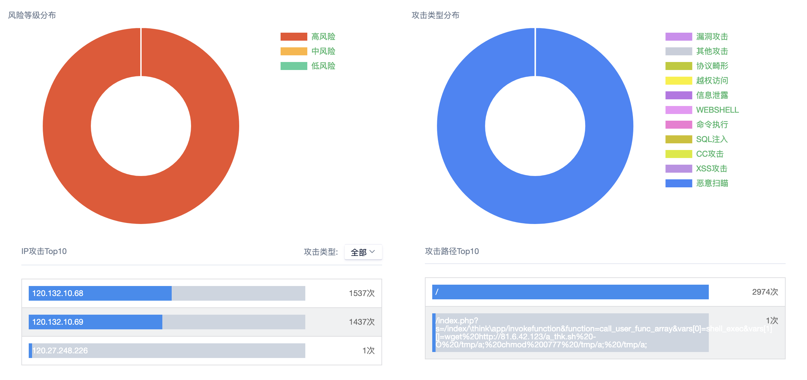
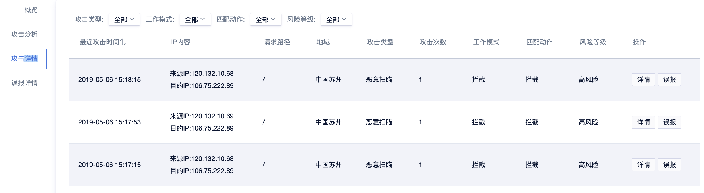

{{indexmenu_n>3}}

# 安全报表

#### 概览

概览中支持查看：

  - 请求数趋势
  - QPS趋势
  - 攻击源IP数
  - 攻击发生次数
  - 上行流量
  - 下行流量

### 攻击分析

前提：选择“域名”，“时间范围”。则攻击分析报表中根据选中的域名和时间范围显示统计分析的结果。 参数说明

  - 防护时间轴：统计一段时间内放行或拦截的攻击次数。如果选择的工作模式是“记录但不拦截”，则防护行为都是“放行”，如果选择的工作模式是“启用防护规则”，则防护行为是“拦截”。配置工作模式参见此处。
  - 风险等级分布：统计发现的不同风险等级的攻击次数。
  - 攻击类型分布：统计不同攻击类型的攻击次数。
  - IP攻击TOP10：攻击次数最多的IP是哪10个（可自行定义攻击类型）
  - 攻击路径TOP10：受到攻击最多的路径是哪10个

### 攻击详情

参数说明

  - 最近攻击时间
  - 来源IP与目的IP
  - 请求路径
  - 地域
  - 攻击类型
  - 攻击次数
  - 工作模式
  - 匹配工作
  - 风险类型
  - 操作 - 详情（可以看到更具体的一些信息）误报 （未来类似的攻击不再显示，即不再判断为攻击）

### 误报详情

`注意：`

点击【误报】后将发生：

1、 未来类似的攻击不再显示，即不再判断为攻击。（此处是根据攻击特征进行的放行，如果是常用的IP，请添加白名单进行放行）

2、 我们的安全工程师将定期统计和分析误报的情况，不断更新和完善规则系统。

